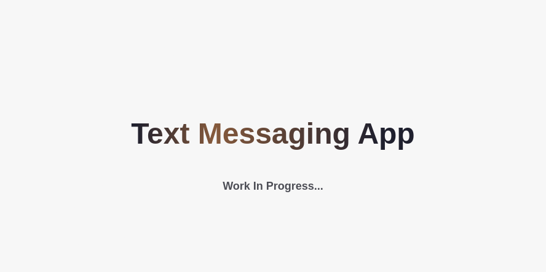
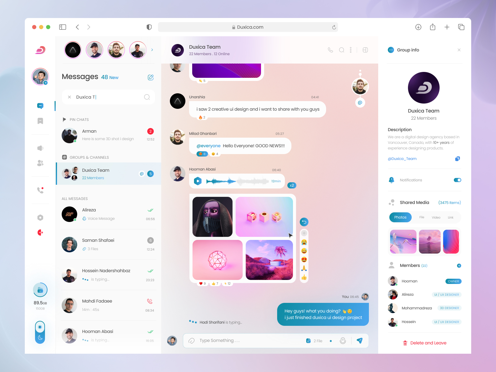

# Cipher-Connect

A fullstack messaging app built with sockets. WIP


## Demo

Deplyed on netlify: [--not yet deplyed--]()

<!--  -->


## Features

- User managment
- User authentication
- Light/dark mode toggle
- Thorough form validation


## Built With

- [tsc-watch](https://www.npmjs.com/package/tsc-watch)
- Typescript-React for the frontend
- Nodejs for backend
- Socket.io for fullduplix communication
- Material ui for design
- Express for handling routes
- mySQL for database
- Prisma as an ORM
- [Formik](https://formik.org/) for handling forms
- Vite for managing development and production ecosystem


## 🚀 What I learned

- Error handling
- Routing
- User authentication
- Building forms with Formik
- Error boundries


## Installation

Install my-project with yarn

```bash
  yarn # Install dependencies
  yarn build # Run build script (optional)

  # One of the following commands
  yarn preview # For production preview
  yarn dev # For development preview
```
    
## Screenshots


## Design

[Mohammad Hashemi](https://dribbble.com/shots/18945888-Messenger-Mobile-Web-Application-Light-Mode/attachments/14116324?mode=media) from [dribble](https://dribbble.com/)


## Acknowledgements

 - [Awesome Readme Templates](https://awesomeopensource.com/project/elangosundar/awesome-README-templates)
 - [Awesome README](https://github.com/matiassingers/awesome-readme)
 - [How to write a Good readme](https://bulldogjob.com/news/449-how-to-write-a-good-readme-for-your-github-project)
 - [Design inspiration](https://dribbble.com/shots/18945888-Messenger-Mobile-Web-Application-Light-Mode/attachments/14116324?mode=media)
 - [prisma-erd-generator](npmjs.com/package/prisma-erd-generator)
 - [prisma-dbml-generator](https://notiz.dev/blog/prisma-dbml-generator#dbml-generator)
 - [Wrap Balancer for balancing paragraphs](https://react-wrap-balancer.vercel.app/)
 - [Glassmorph/ frosted glass effect](https://css.glass/)
 - [MDN's radius generator](https://developer.mozilla.org/en-US/docs/Web/CSS/CSS_backgrounds_and_borders/Border-radius_generator)

## ToDo

- [ ] Show ghost text when user types (not good for performance but it would look really nice).
- [ ] Send a private message to yourself.
- [x] Extract list function from TemproratyDrawer into a separate component.
- [ ] A loader/ spinner for each element that depends on fetching data from server.
- [x] Remove abstraction from TemporaryDrawer, It is causing unnecessary confusion. 
- [x] DO NOT SEND OTHER PEOPLE'S PASSWORD HASHS TO OTHER USERS!!! (How did this even happen??)
- [ ] userRooms in backend should be stored in a set (or something similar) not an array.
- [x] Ensure a room without participants can not exist OR run a scheduled job in DB to delete all rooms without participants.
- [ ] Might wanna use a library like [promise-retry](https://www.npmjs.com/package/promise-retry) to re-run failed queries to DB.
- [x] Add support for group chat.
- [ ] Break text into multiple lines when a single word has too many characters and overflows.

## License

[GPL 3](./LICENSE)

